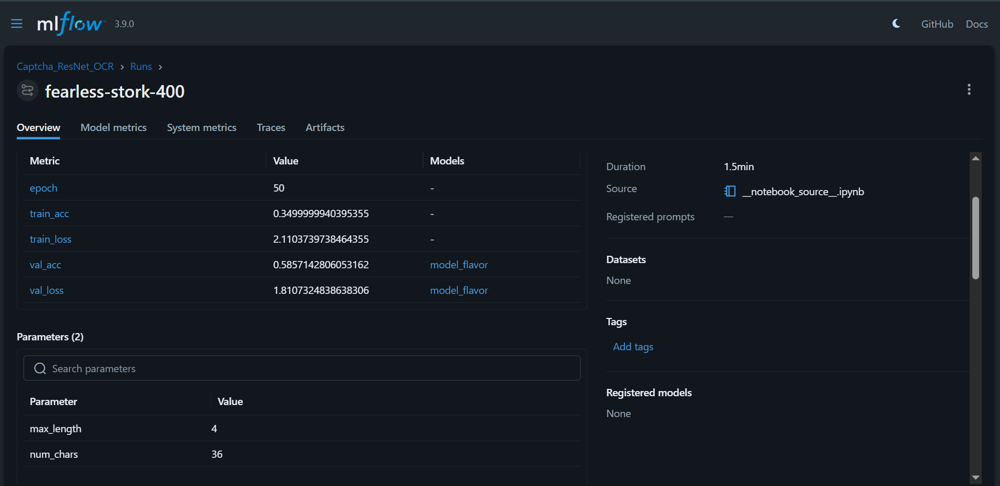
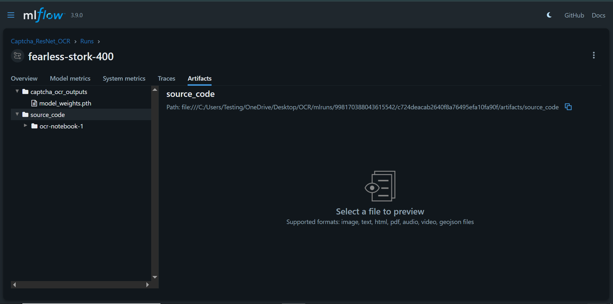

# Captcha OCR with ResNet18 & MLflow Tracking  

This project implements an Optical Character Recognition (OCR) system to solve 4-character alphanumeric captchas. It was developed and trained on **Kaggle** and utilizes **MLflow** for robust experiment tracking and model versioning.  

## 🚀 Project Overview
* **Environment:** Developed on Kaggle using GPU acceleration.  
* **Architecture:** Modified ResNet18 (Single-channel input, Multi-head output).  
* **Tracking:** MLflow used to log Loss, Accuracy, and Model Weights (`.pth`).  
* **Framework:** PyTorch Lightning for scalable and organized training logic.  

---  

## 📊 Performance & Metrics  

### Training Logs  
   
*Visualization of training/validation loss and accuracy captured in the MLflow UI.*  

### Model Artifacts  
  
*The MLflow Artifacts tab showing the saved `model_weights.pth` and source code.*  

---  

## 📂 Repository Structure  

* `ocr-notebook.ipynb`: The main training notebook containing the model architecture and training loop.  
* `ocr_mlflow.ipynb`: The notebook used to launch the dashboard.  
* `fixed_paths.py`: A utility script to fix absolute pathing issues in MLflow meta data.  
* `requirements.txt`: List of Python dependencies.  

---  

## 🛠️ Workflow: From Kaggle to Local Dashboard  

Since this project was built on Kaggle, the MLflow data is stored in a local directory that needs to be moved for local viewing.  

### 1. Downloading the Data
At the end of the training notebook, the `mlruns` directory is zipped.   
1. Download `mlruns.zip` from the Kaggle output directory.  
2. Extract it to the local machine.  

### 2. Fixing the Paths (`fixed_path.py`)  
MLflow records **absolute paths** for artifacts. When moved to the `mlruns` folder from Kaggle's Linux environment to a Windows/Local environment, the dashboard will fail to find the `.pth` weights.  

**Why use `fixed_path.py`?**  
This script scans every `meta.yaml` file in the `mlruns` folder and updates the `artifact_uri` from `/kaggle/working/...` to the current local directory. Without this, the **Artifacts** tab in the MLflow UI will appear empty.  

